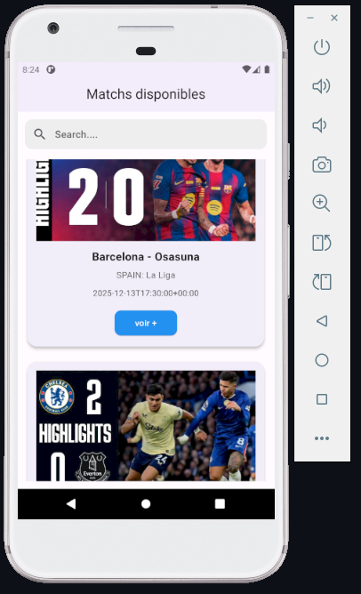

# 📌 Football Replays


**Football Replays** est une application mobile développée avec Flutter, intégrant l'API SoccerBat pour permettre aux utilisateurs de regarder les temps forts des matchs de football en replay. Cette application a été développée pour les passionnés de football qui souhaitent voir les temps forts des matchs qu'ils ont manqués, ou tout simplement revivre les moments forts de ces matchs.

## 🎯 Objectifs du projet

Ce projet a été développé dans un cadre professionnel et éducatif afin de :
- Connecter une API externe à un projet Flutter et interagir avec elle.
- Comprendre et appliquer la clean architecture (data, domaine, présentation).
- Manipuler des gestionnaires d'état comme `ChangeNotifier` et `notifyListeners`.
- Utiliser le package `provider` pour la gestion d'état.
- Découvrir et exploiter des packages importants comme `dio`, `url_launcher`, `webview_flutter`, `flutter_html`, etc.

## 🏗️ Clean Architecture

La clean architecture est une approche qui vise à structurer le code en couches indépendantes, facilitant ainsi la maintenance, les tests et l'évolutivité. Voici les principales couches et leur rôle :

### 1. **Domaine (Domain)**
   - **Rôle** : Contient la logique métier pure et les règles de l'application.
   - **Contenu** :
     - **Entities** : Les modèles métier fondamentaux.
     - **Use Cases** : Les cas d'utilisation qui définissent les actions possibles dans l'application.
   - **Communication** : Cette couche est indépendante des autres. Elle est appelée par la couche présentation et interagit avec la couche data via des interfaces.

### 2. **Données (Data)**
   - **Rôle** : Gère les sources de données (API, base de données locale, etc.).
   - **Contenu** :
     - **Repositories** : Implémentations concrètes des interfaces définies dans le domaine.
     - **Data Sources** : Sources de données externes (API, stockage local, etc.).
   - **Communication** : Fournit les données nécessaires à la couche domaine.

### 3. **Présentation (Presentation)**
   - **Rôle** : Gère l'interface utilisateur et les interactions.
   - **Contenu** :
     - **ViewModels/Controllers** : Gèrent l'état de l'interface utilisateur.
     - **Widgets** : Composants visuels de l'application.
   - **Communication** : Interagit avec la couche domaine pour exécuter les cas d'utilisation.

### Communication entre les couches :
- La couche présentation appelle les **use cases** de la couche domaine.
- La couche domaine utilise les **repositories** pour accéder aux données.
- La couche data implémente les **repositories** et interagit avec les sources de données externes.


## ✨ Fonctionnalités principales

- Afficher et parcourir la liste des matchs disponibles.
- Rechercher un match grâce à son titre.
- Afficher les détails d'un match de football.
- Lancer et visionner la vidéo des temps forts d'un match.
- Afficher les détails sur la compétition d'un match.

## 🛠️ Technologies utilisées

### Backend
- **API SoccerBat (version Free)** : Fournit les données des matchs et les vidéos des temps forts.

### Frontend
- **Flutter** : Framework de développement d'applications mobiles multiplateformes.

### Packages Flutter utilisés
- **dio** : Utilisé pour effectuer des requêtes HTTP vers l'API SoccerBat.
- **provider** : Permet de gérer l'état de l'application de manière réactive.
- **cached_network_image** : Facilite le chargement et la mise en cache des images depuis le réseau.
- **flutter_html** : Permet de rendre du contenu HTML dans l'application.
- **webview_flutter** : Intègre une vue Web pour afficher des pages ou des vidéos directement dans l'application.

## 🚀 Installation et démarrage

1. Clonez le dépôt :
    ```bash
    git clone https://github.com/DJEFFING/football_replays.git
    ```
2. Déplacez-vous dans le projet :
    ```bash
    cd football_replays
    ```
3. Installez les dépendances :
    ```bash
    flutter pub get
    ```
4. Lancez le projet :
    ```bash
    flutter run
    ```

---

---

N'hésitez pas à contribuer ou à signaler des problèmes sur le [dépôt GitHub](https://github.com/DJEFFING/football_replays).